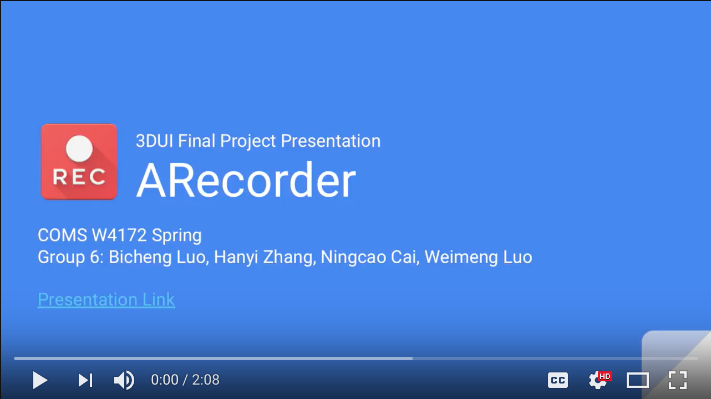

# ARecorder
## Goal
The goal is to create a solution for taking these lab notes while in the midst of an experiment, when stopping to do so can be difficult or inconvenient (e.g. you want to record a description of the texture of stucco you are mixing, but your hands are gloved and covered in sticky plaster) In this project, we created an augmented-reality-based video recording solution to solve the problem of taking video notes in the midst of experiments. We utilized some 3D UI interaction techniques such as video cropping area selection, walking steering travel among multiple videos, wayfinding for other experiment desks, etc. to accomplish this project. More details of this project can be found in the accompanying demonstration videos.

[See the slide of this project.](https://docs.google.com/presentation/d/13KSDWvFRxCU29520SN5u8tbsw6akKYBFVZMS6uWyt0Y/edit?usp=sharing)

## Recording
- Use virtual buttons to switch between different recording states
- Use two hand markers to select a cropping area in the air
- Develop an iOS plugin for Unity to do the frame cropping and write video streams

## Replaying
- Place multiple videos according to their corresponding recording poses
- Wayfinding for other experiment desks
- Support video replaying controls for each clip
- Add a timeline function to view videos according to their corresponding recording time

## Video Recording with Unity & iOS
- Use `UnityEngine.VR.WSA.WebCam.VideoCapture`
  - Only supports Windows Hololens Platform
- Unity Asset Store (RockVR, AVPro Movie ...)
  - $$$ or iOS not supported
- Use `UnityEngine.Apple.ReplayKit` or Everyplay
  - Video clipping not supported
- Final solution
  - **Let's build a native Cocoa plugin for Unity!**

## Demonstration

